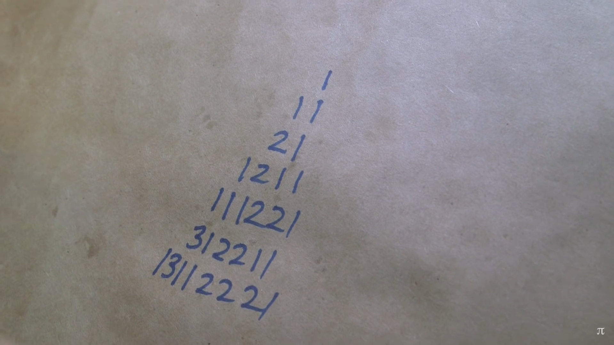

Today I learned that the length of the terms of the “look-and-say” sequence has a well-defined growth rate.

===

# What is the look-and-say sequence?

The look-and-say sequence is a numerical sequence that starts with `1`,
`11`, `21`, `1211`, `111221`.
Can you guess what the next term is?

Each consecutive term comes from “reading out” the contents of the previous term.
So, looking at `111221`, we can split it into groups: `111`, `22`, and `1`.
Then, we read out each group:

 - three `1`s;
 - two `2`s; and
 - one `1`.

So, the next term is `312211`.
And the next:

 - one `3`;
 - one `1`;
 - two `2`s; and
 - two `1`s.

So, the next term would be `13112221`.

# Growth rate

What I just learned is that the length of the next term is, on average,
$1.303577269\cdots$ times larger than the length of the previous term.

So, while we have this interesting sequence that seems to be unrelated to maths,
given that the way in which you build the successive terms is through a word game,
this sequence does exhibit some nice behaviour that maths can explain!

Isn't that cool?!

That's it for now! [Stay tuned][subscribe] and I'll see you around!

[subscribe]: /subscribe
