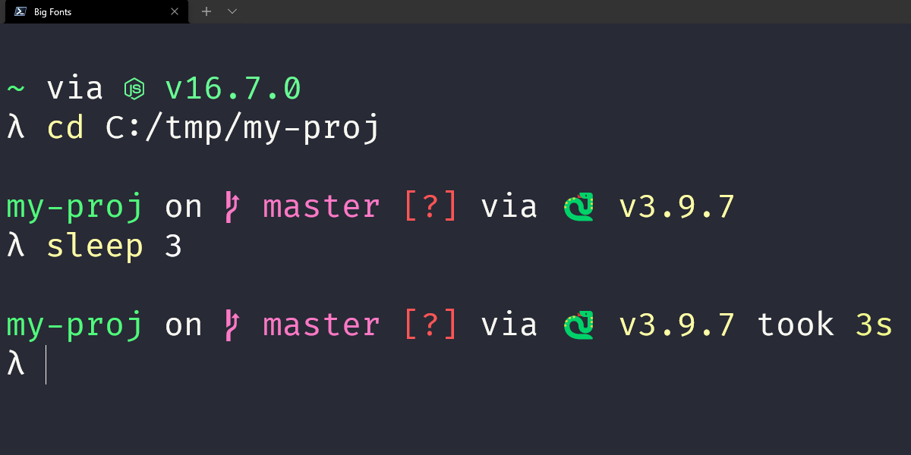

Today I learned how to install the starship cross-shell prompt on Windows for the PowerShell.

===




# What is starship?

[Starship] is a cross-shell prompt that is highly customisable and looks really cool.
The prompt of a shell is that bit that you can typically find on the left of the place where you write commands.

In most shells, the default prompt just shows the path you are in
but starship gives you an enhanced prompt that you can customise greatly!


# How to install starship on Windows for PowerShell

Here is what I did to get starship on my PowerShell.

First, I went to the [starship releases on GitHub][gh-releases] and downloaded the correct file.
For my Windows computer, that was the file `starship-x86_64-pc-windows-msvc.zip`.
After downloading, I unzipped it and the only thing inside was the `starship` executable.

The next step is to configure the PowerShell to run the `starship` executable when it starts.

To prepare for that, I went to `%userprofile%` and created the folder `.starship`.
Inside, I put the executable `starship.exe` and created an (empty) TOML file called `config.toml`
for when I decide to configure starship.
Now we can tell the PowerShell to run the executable `starship.exe` because we know exactly where it is.
On top of that, we also know where we store our starship configuration.

So, in order to have the PowerShell run starship on startup,
we need to modify the PowerShell profile script.
To find out where that script lives, just run `$PROFILE`.
Here is what the result is for me:

```powershell
> $PROFILE
C:\Users\rodri\Documents\PowerShell\Microsoft.PowerShell_profile.ps1
```

That's the path where the script lives.
That script may or may not exist.
If it doesn't, create it.
When you open the script, scroll to the bottom,
and add the command that runs starship:

```powershell
# Tell starship where its config is:
$ENV:STARSHIP_CONFIG = "$HOME\.starship\config.toml"
# Start starship:
Invoke-Expression (&$HOME\.starship\starship init powershell)
```

That's it.
That's about all it takes to get starship installed.

Next thing you probably want to do is install a [Nerd Font][nerd-font] so that the icons that starship uses render properly.
Personally, I enjoy the Fira Code family of fonts!


[starship]: https://starship.rs/
[gh-releases]: https://github.com/starship/starship/releases
[nerd-font]: https://www.nerdfonts.com/font-downloads

That's it for now! [Stay tuned][subscribe] and I'll see you around!

[subscribe]: /subscribe
