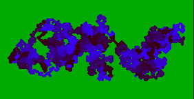
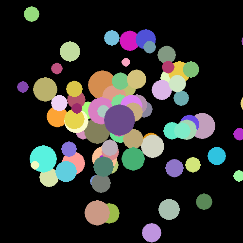

---
metadata:
    description: Neste artigo mostro com o que é que um passeio aleatório se parece.
title: Simular passeios aleatórios em 2D
---

Imagina um bêbedo que cambaleia sem Norte, para aqui e para lá...

===

Passeios aleatórios são isso mesmo! Mais ou menos. Se pensarmos que, para além de estar bêbedo, uma das suas pernas é mais curta que a outra e que ele tende a cambalear mais para um dos lados, então o passeio aleatório já é diferente. Se, ainda para mais, pensarmos que de vez em quando o bêbado se pode teletransportar para uma outra posição perto, temos (algo parecido com) aquilo a que se chama um "Lèvy flight".

Todos estes passeios aleatórios foram implementados por mim em Python, e as implementações podem ser encontradas [aqui](https://github.com/RodrigoGiraoSerrao/projects/tree/master/randomWalks). A imagem de cima é um screenshot da execução do `trailWalk` que é um passeio aleatório que vai deixando um rasto colorido.

Na altura em que fiz isto, fiz também uma animação que vai "salpicando" o ecrã com bolas de várias cores e tamanhos:

O código está no mesmo sítio que o dos passeios aleatórios. Para tudo isto, há executáveis windows [aqui](https://drive.google.com/file/d/0ByBeLS6ciLYVX1k0M2Z2Z2RjYkU/view) e [aqui](https://drive.google.com/file/d/0ByBeLS6ciLYVcDh0a051T3plRlk/view), respetivamente para os passeios e para a animação da tinta.
